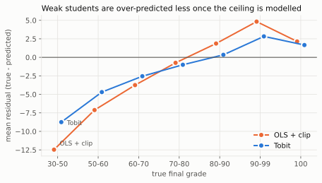
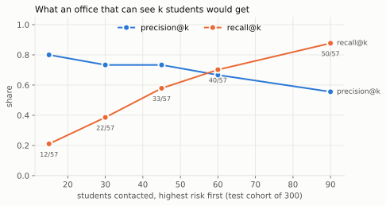

# PathFinder: early warning for first-year dropout

PathFinder predicts two things about a first-year university student: the final grade,
and the risk of dropping out. It started as my Machine Learning course project in the
first year at PSL. This repository rebuilds it, and it also keeps a record of what the
original got wrong ([AUDIT.md](AUDIT.md)): four validation defects, one mis-specified
model, and several claims the method did not support. Every fix is measured.

Every number below is generated from `results/*.json` by the experiment scripts. None
is typed by hand.

<!-- BEGIN:headline -->
- **Modelling the grade ceiling helps where it matters.** A Tobit model cuts the cross-validated RMSE on students below 65 from 9.28 to 8.19 points and their mean over-prediction from 7.0 to 4.7. On the 300-student test set the overall RMSE difference is -0.16 [-0.38, 0.09]: the same direction, but the interval includes zero.
- **The original validation over-promised.** Oversampling before cross-validation reported precision 0.81; the test set delivered 0.51.
- **A usable answer for an advising office:** contacting the 30 highest-risk of 300 test students finds 22 of the 57 dropouts (precision 0.73 [0.60, 0.90]).
- **All of it on synthetic data.** Several features are uniformly distributed and dropouts have final grades. The early-warning question needs real data: see *Early warning on real data* below.
<!-- END:headline -->

## Read this first: the data is synthetic

The course supplied the dataset (1,100 training and 300 test students, 11 behavioural
and contextual features). Its provenance is not documented, and it does not look like
real students. Several features are spread evenly between two round numbers: a p-value
far above 0.05 below means the values are indistinguishable from a uniform draw.

<!-- BEGIN:synthetic -->
| feature | range | KS test p-value vs uniform |
|---|---|---|
| `attendance_rate_pct` | 40.07 to 99.95 | 0.962 |
| `assignment_completion_pct` | 25 to 100 | 0.000 |
| `quiz_average_pct` | 20.05 to 99.95 | 0.781 |
| `hours_self_study_week` | 0.02 to 24.99 | 0.024 |
| `prior_gpa_20` | 6.01 to 19.99 | 0.611 |
| `internet_reliability_score` | 0 to 9.99 | 0.730 |
| `commute_minutes` | 5 to 90 | 0.799 |
| `financial_stress_score` | 0 to 9.99 | 0.081 |
| `participation_score` | 1.06 to 10 | 0.000 |

Grades exactly 100: **18.9%** of the training set. Students who dropped out still have a final grade (mean 63.6, against 86.5 for the others).
<!-- END:synthetic -->

So every finding on this dataset describes the process that generated it. For example,
"linear models beat trees" tells you the generator is close to linear; it says nothing
about students. The code and the method carry over to real data; the numbers do not.

## Task 1: the final grade is censored at 100

About one grade in five is exactly 100. A 100 does not mean the student's performance
was 100. It means it was *at least* 100. Ordinary least squares treats those rows as
exact. That flattens every slope, and the model then over-predicts weak students and
predicts impossible grades above 100. The original notebook clipped predictions to 100.
Clipping fixes the impossible grades, but the flattened slopes stay. The notebook then
put the over-prediction of weak students down to "a structural limitation of the
feature set".

A **Tobit model** states the censoring instead. It assumes a latent grade
`Y* = Xb + e`, with `e` normally distributed, and observes `Y = min(Y*, 100)`. It then
fits `b` by maximum likelihood, so a censored row contributes `P(Y* >= 100)` instead of
a density. It is implemented from scratch in
[`src/pathfinder/censored.py`](src/pathfinder/censored.py), with an analytic gradient,
and checked three ways. It reproduces least squares exactly when nothing is censored.
It recovers known parameters from simulated censored data. Its expected-value formula
matches Monte Carlo.



**Selection (training set only, 5 × 5-fold cross-validation):**

<!-- BEGIN:grade_cv -->
| model | RMSE [min, max over repeats] | MAE | R² | errors > 15 pts | RMSE, grade < 65 | mean residual, grade < 65 |
|---|---|---|---|---|---|---|
| OLS + clip | 6.23 [6.21, 6.25] | 4.64 | 0.817 | 27.4 | 9.28 | -7.01 |
| Ridge + clip | 6.25 [6.23, 6.27] | 4.67 | 0.815 | 27.4 | 9.45 | -7.27 |
| Tobit (chosen) | 6.04 [6.02, 6.06] | 4.46 | 0.828 | 25.6 | 8.19 | -4.69 |
| Gradient boosting | 7.32 [7.30, 7.35] | 5.65 | 0.746 | 56.2 | 11.66 | -9.57 |

5 repeats of 5-fold CV on the 1100 training students. Tobit minus OLS + clip, RMSE, same folds: -0.193, -0.189, -0.193, -0.187, -0.177 (better in 5 of 5 repeats).
<!-- END:grade_cv -->

**The one evaluation on the held-out test set:**

<!-- BEGIN:grade_test -->
| model | RMSE | MAE | R² | errors > 15 pts | RMSE, grade < 65 (n = 35) |
|---|---|---|---|---|---|
| Tobit | 5.97 [5.41, 6.50] | 4.44 [4.00, 4.89] | 0.842 [0.800, 0.875] | 7 | 8.39 [6.52, 10.16] |
| OLS + clip | 6.13 [5.60, 6.63] | 4.61 [4.17, 5.06] | 0.833 [0.796, 0.862] | 8 | 9.62 [7.95, 11.19] |

Paired difference in RMSE (Tobit minus OLS + clip): **-0.16 [-0.38, 0.09]**. 300 test students, 95% bootstrap intervals.
<!-- END:grade_test -->

The cross-validated gain is small and has the same sign in each repeat (per-repeat
differences above). On the test set alone the interval for the difference includes zero,
and I report it that way.
The larger effect is where the original notebook located its problem: students below 65.

## Task 2: dropout risk, and what an office can do with it

The model is a plain logistic regression. I did not use oversampling or class weights.
Both push the predicted probabilities away from the real 15% base rate (see the
calibration error below), and the decision policy needs honest probabilities.

<!-- BEGIN:dropout_cv -->
| model | AUC [min, max] | average precision | Brier | calibration error | mean predicted P (true rate 0.150) | precision@110 |
|---|---|---|---|---|---|---|
| Logistic (chosen) | 0.942 [0.938, 0.943] | 0.761 | 0.067 | 0.021 | 0.150 | 0.744 |
| Logistic, balanced weights | 0.942 [0.939, 0.943] | 0.765 | 0.098 | 0.121 | 0.271 | 0.753 |
| Gradient boosting | 0.920 [0.917, 0.923] | 0.712 | 0.073 | 0.025 | 0.142 | 0.762 |
<!-- END:dropout_cv -->

The original notebook's threshold (0.258, as printed) maximised the F2 score. F2 weights recall
four times as much as precision, and nobody chose that weighting on purpose. An advising
office has one of two real constraints instead:

- **Capacity.** It can meet k students this week. No threshold is needed: rank by risk
  and take the top k.
- **Cost.** A missed dropout costs `c_fn` and an unneeded meeting costs `c_fp`. With
  calibrated probabilities, the best threshold is `c_fp / (c_fp + c_fn)`. It follows
  from the costs and is not searched for. I state a ratio of 5 as an assumption, and
  show what happens under other ratios.



<!-- BEGIN:dropout_test -->
Model: Logistic. 300 test students, 57 dropouts.

| AUC | average precision | Brier | calibration error | mean predicted P | observed rate (train rate) |
|---|---|---|---|---|---|
| 0.922 [0.883, 0.954] | 0.721 [0.617, 0.833] | 0.087 [0.069, 0.107] | 0.057 | 0.159 | 0.190 (0.150) |

**Capacity policy** (contact the top k by risk). With k = 30 (10% of the cohort): precision 0.73 [0.60, 0.90], recall 0.39 [0.32, 0.47].

| students contacted (k) | dropouts found | precision@k | recall@k |
|---|---|---|---|
| 15 | 12/57 | 0.80 | 0.21 |
| 30 | 22/57 | 0.73 | 0.39 |
| 45 | 33/57 | 0.73 | 0.58 |
| 60 | 40/57 | 0.67 | 0.70 |
| 90 | 50/57 | 0.56 | 0.88 |

**Cost policy** (contact when P > c_fp / (c_fp + c_fn)). At the stated ratio 5, threshold 0.167: 79 flagged, recall 0.82 [0.72, 0.91], precision 0.59 [0.52, 0.68].

| cost of a missed dropout / cost of a meeting | threshold | flagged | recall | precision |
|---|---|---|---|---|
| 2 | 0.333 | 56 | 0.70 | 0.71 |
| 5 | 0.167 | 79 | 0.82 | 0.59 |
| 10 | 0.091 | 100 | 0.93 | 0.53 |
| 20 | 0.048 | 116 | 0.95 | 0.47 |
<!-- END:dropout_test -->

The model predicts a mean risk close to the *training* dropout rate. The test cohort
has more dropouts than the training cohort. A deployed model would need the base rate
of the cohort it scores, and this repository does not estimate it.

### What the "reasons" mean

For each student, `pathfinder rank` lists the three features that raised the risk most.
For a linear model these contributions are exact: coefficient × (value − average). They
explain **the model**, not the student. "Low attendance raised the score" is not
evidence that raising attendance would prevent dropout. The original notebook's
counterfactuals ("what the student should change") made that causal step. This
repository does not.

## Early warning on real data

The original claims "early warning", but the course data has no time dimension: the
notebook cannot say *when* a prediction would be available. The
[Open University Learning Analytics Dataset](https://analyse.kmi.open.ac.uk/open_dataset)
(OULAD; Kuzilek, Hlosta and Zdrahal, *Scientific Data*, 2017) records daily activity on
the course website and assessment submissions for 22 course presentations.
[`src/pathfinder/early_warning.py`](src/pathfinder/early_warning.py) builds, for each
week w, the students still registered on day 7w. It uses only information dated before
that day, trains on the 2013 and 2014B presentations and tests on 2014J. A test appends
future clicks and submissions and checks that no feature moves.

<!-- BEGIN:early_warning -->
_Not run yet. The OULAD files were not reachable where this was written; see data/README.md, then run experiments/05_early_warning_oulad.py._
<!-- END:early_warning -->

## Use it

```
pathfinder rank --train data/raw/track_f_student_success_train.csv \
                --students new_students.csv --capacity 30 --out contact_list.csv
```

The command writes the students sorted by risk. Each row has the dropout probability,
the expected grade, a contact flag for the top `capacity` students, and the three
largest reasons.

## Reproduce

Windows (PowerShell), from the repository root:

```
py -3.13 -m venv .venv
.venv\Scripts\python -m pip install -e ".[dev]"
.venv\Scripts\python experiments\run_all.py      # every experiment, figure and table
.venv\Scripts\python -m pytest
```

On Linux or macOS use `.venv/bin/python`. The course CSVs go in `data/raw/`, and the
OULAD CSVs in `data/raw/oulad/` (see [data/README.md](data/README.md)).

| path | role |
|---|---|
| `src/pathfinder/censored.py` | Tobit regression, a scikit-learn estimator |
| `src/pathfinder/models.py` | candidate pipelines for both tasks (preprocessing inside each) |
| `src/pathfinder/evaluate.py` | repeated CV, bootstrap intervals, calibration |
| `src/pathfinder/decide.py` | capacity (top k) and cost (Bayes threshold) policies |
| `src/pathfinder/explain.py` | exact per-feature contributions of a linear model |
| `src/pathfinder/oulad.py`, `early_warning.py` | OULAD snapshots at week w, forward-in-time evaluation |
| `experiments/00`–`05` | synthetic check, selection, single test evaluation, audit, figures, OULAD |
| `experiments/render_readme.py` | fills this file's tables from `results/` |

## Limitations

- Synthetic data (see above). None of the numbers on the course dataset is a claim about
  students.
- 300 test students, of whom 57 dropped out: intervals are wide, and they are shown.
- The dropout model is calibrated to the training base rate. The test base rate is
  higher.
- The cost ratio of 5 is an assumption. A real office would have to state its own.
- The early-warning experiment has been checked on a fixture with OULAD's schema. It
  has not yet been run on the real files.
